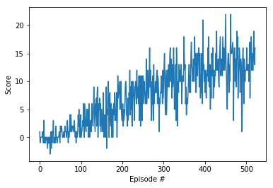

# Implementation
----------------------------------------------------------------------------------------------------------------------

## Learning Algorithm

The Deep Q-Learning Algorithm outlined in [this research paper](https://storage.googleapis.com/deepmind-media/dqn/DQNNaturePaper.pdf) is used. The algorithm uses *experience replay* and can be outlined as follows:
- Initialize replay memory.
- Initialize action-value function with random weights.
- Initialize target action-value function.
- For each episode:
    - Initialize score.
    - For each time step:
        - With probability epsilon select a random action, otherwise select the action with the maximum Q value.
        - Execute action and record reward.
        - Update state.
        - Store the transition.
        - Sample random minibatch of transitions from memory.
        - Perform a gradient descent step.
        
      **End For**
        
  **End For**

## Hyperparameters

While the below default values from the `DQN` exercise solution from an earlier lesson did the job, some tuning to certain hyperparameters would improve the results and decrease the training required. Some of those are: increasing the batch size to make the training more stable and less oscillating, decreasing the learning rate for the same reason, updating the network more often, and decreasing the starting value of epsilon, and the epsilon-decay factor to utilize the training more effectively.

### Agent Hyperparameters
```
BUFFER_SIZE = int(1e5) # replay buffer size
BATCH_SIZE = 64        # minibatch size
GAMMA = 0.99           # discount factor
TAU = 1e-3             # for soft update of target parameters
LR = 5e-4              # learning rate
UPDATE_EVERY = 4       # how often to update the network
```
### Network Hyperparameters
```
n_episodes = 2000      # maximum number of training episodes
max_t = 1000           # maximum number of time steps per episode
eps_start = 1.0        # starting value of epsilon, for epsilon-greedy action selection
eps_end = 0.01         # minimum value of epsilon
eps_decay = 0.995      # multiplicative factor (per episode) fro decreasing epsilon
```

## Model Architecture

The model uses two identical `QNetqork`'s, each has an input the same size as the state space, and is composed of two fully connected layers of dimesnion `64` each followed by a Relu activation layer, and finally a third fully connected layer with an output the same size as the action space.

## Scores vs Episodes

### Reward Plot


### Total Number of Episodes
`Environment solved in 422 episodes!	Average Score: 13.04`

## Ideas for Future Work

Some more challenges to try would be to:

- Train the agent using images instead, which would require re-designing the `QNetwork` architecture to include convolutional layers.
- Apply *Double DQN* to minimize overestimation of action values.
- Apply *Dueling DQN* to generalize learning across actions without imposing any change to the underlying reinforcement learning algorithm.
- Implement *Prioritized Experience Replay* to replay important transitions more frequently, and therefore learn more efficiently.
